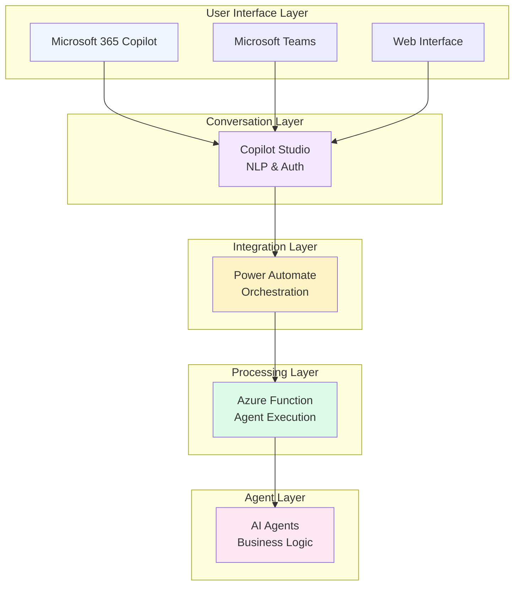
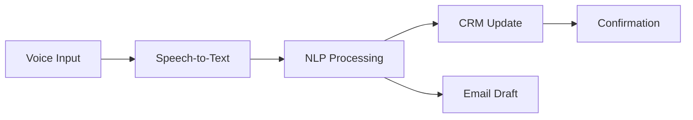

MAIN USER PAGE: https://kody-w.github.io/AI-Agent-Templates/

# AI Agent Templates 🚀

A comprehensive collection of AI agent templates and stacks for building intelligent automation solutions with Azure and Microsoft 365 integration.

[](https://portal.azure.com/#create/Microsoft.Template/uri/https%3A%2F%2Fraw.githubusercontent.com%2Fkody-w%2FAI-Agent-Templates%2Fmain%2Fazuredeploy.json)

## 🌟 Quick Start - Three Ways to Deploy

### 1. Azure Deployment (Recommended)
Deploy complete infrastructure in minutes with our one-click Azure deployment.

### 2. Microsoft 365 Copilot Integration
Connect your agents directly to Teams and M365 Copilot using our Power Platform solution.

### 3. Standalone Development
Use individual agents and stacks in your own applications.

## 🏗️ Solution Architecture



## 🚀 Getting Started

### Step 1: Deploy to Azure (1 minute)

Click the Deploy to Azure button above or use this link:
```
https://portal.azure.com/#create/Microsoft.Template/uri/https%3A%2F%2Fraw.githubusercontent.com%2Fkody-w%2FAI-Agent-Templates%2Fmain%2Fazuredeploy.json
```

This deploys:
- ✅ Azure OpenAI Service (GPT-4o)
- ✅ Azure Function App
- ✅ Storage Account
- ✅ Application Insights

### Step 2: Test Your Endpoint

After deployment, get your function URL from the Azure Portal:

```bash
curl -X POST [YOUR_FUNCTION_URL] \
  -H "Content-Type: application/json" \
  -d '{"action": "test", "agent": "basic_agent"}'
```

### Step 3: Connect to Microsoft 365 (Optional)

1. **Download Power Platform Solution**: [MSFTAIBASMultiAgentCopilot_1_0_0_2.zip](https://github.com/kody-w/AI-Agent-Templates/raw/main/MSFTAIBASMultiAgentCopilot_1_0_0_2.zip)

2. **Import to Power Platform**:
   - Go to [make.powerapps.com](https://make.powerapps.com)
   - Solutions → Import solution
   - Upload the ZIP file

3. **Configure Power Automate**:
   - Edit "Talk to MAC" flow
   - Update HTTP action with your Azure Function URL
   - Save and activate

4. **Deploy to Teams/M365**:
   - Open in [Copilot Studio](https://copilotstudio.microsoft.com)
   - Channels → Microsoft Teams → Turn on
   - For M365 Copilot: Enable M365 channel

## 📁 Project Structure

```
AI-Agent-Templates/
├── agents/                    # Individual agent templates
│   ├── basic_agent.py         # Base agent class
│   ├── calendar_agent.py      # Calendar scheduling
│   ├── dynamics_365_agent.py  # Dynamics 365 CRM
│   ├── email_drafting_agent.py # Email composition
│   └── ...                    # 20+ more agents
├── agent_stacks/              # Complete solutions
│   ├── voice_to_crm_stack/    # Voice-enabled CRM
│   ├── crm_bulk_data_stack/   # Test data generation
│   ├── email_drafting_stack/  # Email automation
│   └── simulation_sales_stack/ # Sales training
├── azuredeploy.json           # Azure ARM template
├── index.html                 # Web interface
└── manifest.json              # Agent registry
```

## 🤖 Available Agents

### Core Agents
- **BasicAgent**: Base class for all agents
- **ContextMemoryAgent**: Persistent memory capabilities
- **ManageMemoryAgent**: Memory optimization

### Business Integration
- **Dynamics365Agent**: Microsoft Dynamics 365 operations
- **SalesforceQueryAgent**: Salesforce data queries
- **ServiceNowAgent**: ServiceNow ticket management
- **CalendarAgent**: Meeting scheduling
- **EmailDraftingAgent**: Intelligent email composition

### AI & Automation
- **ImageGenerationAgent**: DALL-E image generation
- **CodeReviewAgent**: Automated code analysis
- **PowerPointAgent**: Presentation generation
- **DuckDuckGoSearchAgent**: Web search capabilities

## 🛠️ Agent Stacks

Complete, production-ready solutions combining multiple agents:

### Voice to CRM Stack


**Features:**
- Real-time voice transcription
- Entity extraction
- Automatic CRM record creation
- Email drafting from voice
- SharePoint integration

### CRM Bulk Data Creator Stack
Generate realistic test data for CRM systems:
- 1000s of customer records
- Complex relationships
- GDPR-compliant data
- Industry templates

### Email Drafting Stack
AI-powered email automation:
- Context-aware generation
- Multi-language support
- Sentiment analysis
- Template management

### Sales Simulation Stack
Advanced training platform:
- Customer persona simulations
- Real-time coaching
- Objection handling
- Performance analytics

## 💻 Development Guide

### Creating a Custom Agent

```python
from agents.basic_agent import BasicAgent

class CustomAgent(BasicAgent):
    def __init__(self):
        self.name = "CustomAgent"
        self.metadata = {
            "name": self.name,
            "description": "Your agent description",
            "parameters": {
                "type": "object",
                "properties": {
                    "input": {
                        "type": "string",
                        "description": "Input parameter"
                    }
                },
                "required": ["input"]
            }
        }
        super().__init__(name=self.name, metadata=self.metadata)
    
    def perform(self, **kwargs):
        input_data = kwargs.get('input', '')
        # Your logic here
        return f"Processed: {input_data}"
```

### Using Agent Stacks

```python
from agent_stacks.voice_to_crm_stack.agents.dynamics_365_agent import Dynamics365Agent

# Initialize agent
dynamics = Dynamics365Agent()

# Create CRM record
result = dynamics.create_account({
    "name": "Contoso Corp",
    "revenue": 1000000
})
```

## 🔧 Configuration

### Environment Variables

```bash
# Azure OpenAI
AZURE_OPENAI_API_KEY="your-key"
AZURE_OPENAI_ENDPOINT="your-endpoint"
AZURE_OPENAI_DEPLOYMENT_NAME="gpt-4o"

# Azure Storage
AZURE_STORAGE_CONNECTION_STRING="your-connection"

# Dynamics 365 (if using CRM agents)
DYNAMICS_365_CLIENT_ID="your-client-id"
DYNAMICS_365_CLIENT_SECRET="your-secret"
DYNAMICS_365_TENANT_ID="your-tenant"
DYNAMICS_365_RESOURCE="your-resource"
```

## 🌐 Web Interface

Open `index.html` to access:
- **Discovery Tool**: Find the right agents for your needs
- **Setup Guide**: Step-by-step deployment instructions
- **Template Library**: Browse and export agent stacks
- **Agent Store**: Individual agent catalog

### Features
- 🎯 Interactive agent selection
- 📦 One-click stack export
- 🔄 Live API integration
- 📊 Visual architecture diagrams

## 📊 Performance & Scalability

```mermaid
graph LR
    subgraph "Load Distribution"
        LB[Load Balancer] --> F1[Function 1]
        LB --> F2[Function 2]
        LB --> F3[Function N]
    end
    
    subgraph "Caching Layer"
        F1 --> Cache[Redis Cache]
        F2 --> Cache
        F3 --> Cache
    end
    
    subgraph "Storage"
        Cache --> Storage[Azure Storage]
        Cache --> DB[(Cosmos DB)]
    end
```

### Optimization Features
- **Manifest-based loading**: Instant load times
- **Raw URL fallback**: No API rate limits
- **Agent caching**: Reduced latency
- **Parallel execution**: Multi-agent processing

## 🔐 Security & Compliance

- **Azure AD Integration**: Enterprise authentication
- **Managed Identities**: Secure credential handling
- **RBAC**: Role-based access control
- **Audit Logging**: Complete activity tracking
- **GDPR Compliant**: Data privacy controls

## 📈 Monitoring & Analytics

The solution includes built-in monitoring:
- Application Insights integration
- Custom metrics tracking
- Performance dashboards
- Error tracking and alerts

## 🤝 Contributing

We welcome contributions! See our [Contributing Guide](CONTRIBUTING.md) for details.

### Adding a New Agent
1. Create Python file in `agents/`
2. Extend `BasicAgent` class
3. Implement `perform()` method
4. Add metadata
5. Update manifest

### Adding a Stack
1. Create directory in `agent_stacks/`
2. Add agents, demos, and metadata
3. Include demo HTML
4. Update documentation

## 📚 Resources

- [Azure OpenAI Documentation](https://learn.microsoft.com/azure/ai-services/openai/)
- [Copilot Studio Guide](https://learn.microsoft.com/microsoft-copilot-studio/)
- [Power Platform Documentation](https://learn.microsoft.com/power-platform/)
- [Azure Functions Guide](https://learn.microsoft.com/azure/azure-functions/)

## 💰 Cost Estimation

| Component | Monthly Cost |
|-----------|-------------|
| Azure Function App | ~$0 (consumption plan) |
| Storage Account | ~$5 |
| Azure OpenAI | Pay-per-use (~$0.01/1K tokens) |
| **Total** | **~$5-10/month + usage** |

## 🆘 Support

- **Issues**: [GitHub Issues](https://github.com/kody-w/AI-Agent-Templates/issues)
- **Discussions**: [GitHub Discussions](https://github.com/kody-w/AI-Agent-Templates/discussions)
- **Documentation**: [Wiki](https://github.com/kody-w/AI-Agent-Templates/wiki)

## 📝 License

This project is provided as-is for educational and development purposes.

---

**Built with ❤️ for the AI community**

⭐ Star this repo if it helps you!
