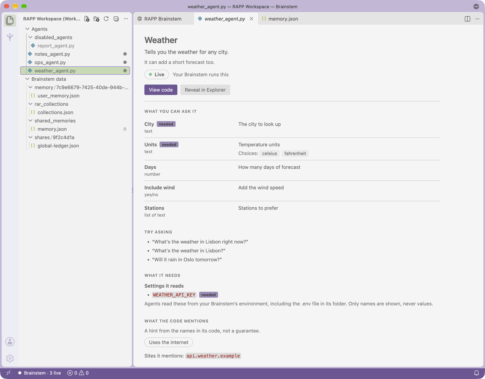
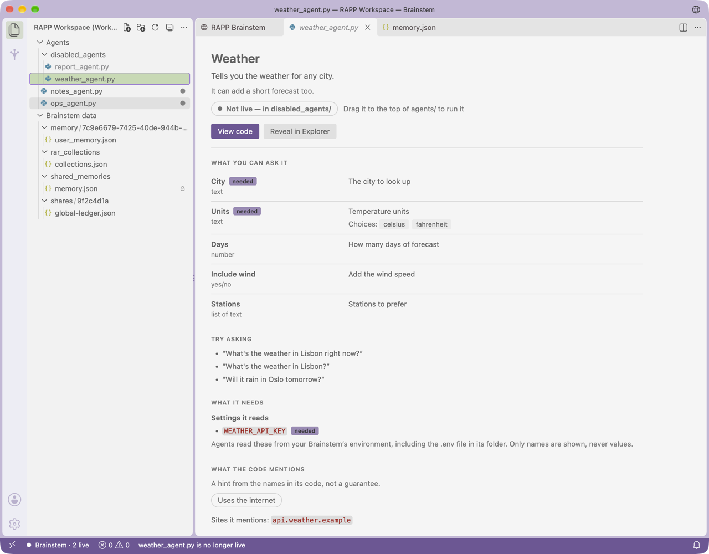
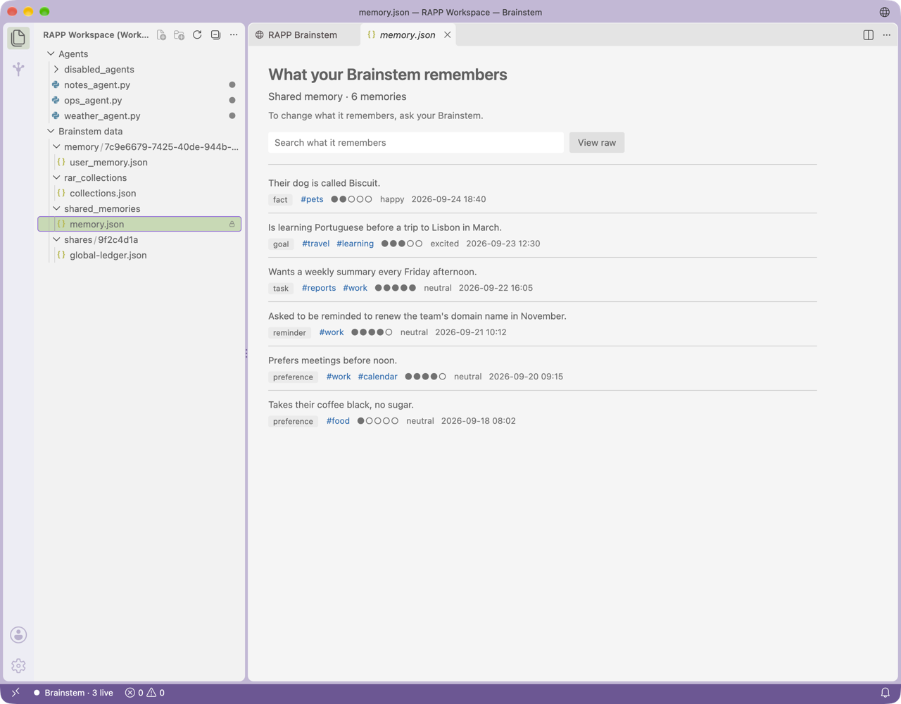
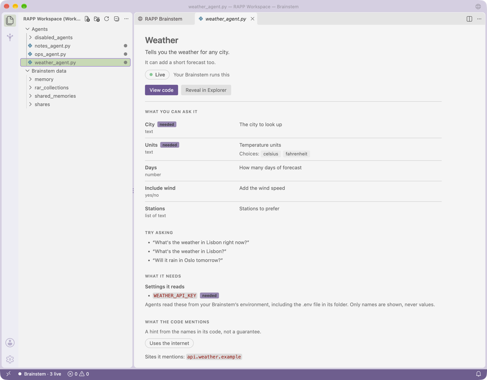

# Brainstem

**The one surface you talk to, with your Hives and references beside it.**

Brainstem is a minimal desktop app built on a pinned fork of Code - OSS, the open
source code editor. It keeps the editor and gives it the RAPP shape: you talk to
your Brainstem, your Hives and references sit beside it, and your agents and
what your Brainstem remembers open as cards in plain words.

> **Status: newest channel, not part of RAPP/1.** In the owner's words, "RAPP/1
> is the LTS version for the whole thing": what ships under RAPP/1 is healthy
> and never experimental. This app is an experiment in the newest channel, a
> frontier canary, and is not part of RAPP/1 until the owner graduates it; only
> then does it go to RAPP `main`. Build it from source; there is no installer or
> signed download. Protocol authority stays with
> [`RAPP1_AUTHORITY.json`](../RAPP1_AUTHORITY.json) and
> [`RAPP1_STATUS.md`](../RAPP1_STATUS.md): this repository remains NOT YET FULLY
> RAPP/1 CONFORMANT, and the app adds no wire forms.

## What you see

The Explorer shows your **RAPP Workspace**: your Brainstem's agents and, read-only,
its data (see below). Select an agent file and the main pane shows its **agent
card**; select a memory file and it shows **what your Brainstem remembers**. One
activity-bar container, **Brainstem**, sits next to it, with four views:

| View | What it does |
|---|---|
| **Brainstem** | A chat with the Brainstem on this device (`/chat` and `/health` on `127.0.0.1:7071`), with its status. If none is running it says so plainly, offers **Start my Brainstem**, and shows the grail one-liner, pinned, on macOS and Linux (there is no pinned one for Windows yet); if another program holds its address, or it is running but busy or not answering, it says that instead, with **Check again**; not yet signed in, it offers **Sign in**, which opens its page. |
| **Hives** | A read-only tree of the Hives in `~/Hives` (or `RAPP_HIVES`): members (`members/*/keys`), waiting requests and rooms (`shared/*`). Each Hive shows the verdict of the Hive agent's own checker. Opening a file opens it in the editor. |
| **References** | Each Hive's pinned reference labels from `.git/rapp-hive/references.json`, read-only. Labels show; full paths only on hover. |
| **Organism** | Where this app sits in the organism, the organism graph, and the one-page view (pinned copies from `kody-w/rapp-work` at `ef74030`, which title it "The RAPP/1 organism"; their "experimental" marks are newest-channel work, not part of RAPP/1). |

References and Organism start collapsed, so the chat has the room; open either from its header.

Commands: **Brainstem: Ask**, **Hive: Check**, **Hive: Reveal in Finder/Explorer**,
**Hive: Save changes (asks your Brainstem)**, **Hive: Refresh**, **Brainstem:
Open your Brainstem**, **Brainstem: Start my Brainstem**, **Brainstem: Show the
Brainstem web UI**, **Brainstem: Show agent card**, **Brainstem: Open the
organism one-page view**. The RAPP Workspace needs no commands: it is the
Explorer, and agents move by drag and drop.

### It opens on your Brainstem

The app starts on the global Brainstem, the folder the grail installer puts your
Brainstem in, and shows its **RAPP Workspace**: its `agents/` folder and,
read-only, its data, the only parts of it you need.

1. **The Brainstem folder.** It is the setting `rapp.brainstemFolder`; else the
   folder your running Brainstem reports on `/health` (`brainstem_dir`), when that
   is a full local path to a folder holding `brainstem.py`; else the installer's
   default, `~/.brainstem/src/rapp_brainstem`. Every candidate must be a full
   local path to a folder with `brainstem.py`, outside your Hives and references.
   `/health` is an unauthenticated answer on a loopback port, so the folder it
   reports is taken only when it is the setting's or the default folder (through
   a link or not; it is then named by that folder's own path), or else as its
   real path, when it is yours and writable by no one else and every folder
   above it is yours or the system's and writable by no one else (a sticky
   folder such as `/tmp` counts as safe). That is checked on macOS and Linux;
   Windows has no such mode bits, so there a folder only `/health` reports is
   never taken. It never chooses a Python to run.
2. **The RAPP Workspace** is the setting `rapp.agentsFolder`, else that folder's
   `agents/`, which must exist, with that folder's `.brainstem_data/` as a second,
   read-only root as soon as it exists, even while the window is open. It opens
   as a workspace whose window is titled "RAPP Workspace" (`window.title` set in
   the workspace file). The app keeps that `RAPP Workspace.code-workspace` file
   in its own storage, one for each Agents folder (under
   `workspaces/<digest of its real path>/`, or the next free one when a person
   took agents/ out of that file; the single file earlier builds kept stays in
   use while it is there and lists that folder), so nothing is written into the
   Brainstem's folder, and a new Agents folder opens as a new workspace, which
   the host judges afresh and the Brainstem asks about by name. The app reads
   these files as the host does, past a slip such as a missing comma: one the
   host would open with agents/ among its roots stays that folder's (and is
   written only once it reads as plain JSON again), while one the host could
   not open (empty, cut short before its folders, or unreadable now) is passed
   over and left exactly as it is. No workspace's roots are
   changed or reordered by the app: a file is written whole only when it is
   created, and after that only the window that has it open adds or updates its
   data root and rules. In one of its own files, agents/ anywhere among the
   roots is the RAPP Workspace, in the order you give them; a root added or
   taken out without a reload makes the window enter or leave the RAPP
   Workspace as it happens. From a window on another of its files (another
   Agents folder's, say), Open your Brainstem opens the RAPP Workspace in a
   window of its own, so that window keeps its conversation.
3. **An empty window** opens the RAPP Workspace in the same window while no
   other window shows it: when the app starts, and when it is opened again after
   its windows were closed (on macOS the app keeps running then). A new window
   beside the RAPP Workspace, or a window whose folder was just closed there,
   stays empty, and a window holding a file you opened is left alone. (A small
   file in the app's own storage notes each window that shows the RAPP
   Workspace, and when one last left it, as its folder closed or it reloaded;
   an empty window stays empty while another window of this launch shows it,
   or for 15 seconds after one left it.) **A window on the Brainstem's own
   folder** (what earlier builds opened) switches to the RAPP Workspace too.
   Any other folder is left alone.
4. **The RAPP Workspace** shows the Brainstem's own web UI in the host's
   integrated browser (`workbench.action.browser.open`): an editor tab titled by
   the page, "RAPP Brainstem", with a URL bar, back, forward and reload. Its
   `reuseUrlFilter` (for example `http://127.0.0.1:7071/**`, built from
   `rapp.brainstemUrl`) focuses the Brainstem's tab, a restored one included,
   instead of opening another, and shows it as it is: the web UI keeps its
   conversation only in the page, and upstream would reload a reused tab. One
   anchored edit in `overlay.json` keeps it from navigating a tab already on the
   same origin, unless that tab's last load failed (another origin is still
   navigated to). So Show the Brainstem web UI, Open your Brainstem, Start my
   Brainstem (whether it finds the Brainstem running or starts it), and an
   extension host restart all leave a conversation in place, while a tab that
   could only show that nothing answered loads the page again. Where that
   browser is missing (the `--web` build), the built-in Simple Browser shows the
   page in the first editor column without taking focus. The overlay keeps
   `extensions/simple-browser`, removes nothing of the integrated browser and
   sets none of its settings; the tab-reuse edit above is its only change there.
5. **When your Brainstem is not running,** the Brainstem view's offline card
   opens instead, with **Start my Brainstem**. Only when you click it does the
   app open a visible terminal in the Brainstem folder that runs the folder's
   own `start.sh` (on Windows `start.ps1`, through `powershell.exe
   -ExecutionPolicy Bypass -File .\start.ps1`) and nothing else: the terminal
   ends when the Brainstem does, and is not revived after the app restarts. It
   then waits up to 60 seconds for `/health` to answer and shows the web UI;
   meanwhile the view says "Starting your Brainstem…". While that script still
   runs, Start in the same window shows its terminal instead of starting
   another; closing the terminal stops it. A Brainstem the app started runs in
   the app's terminal, so quitting the app stops it, and the app asks first
   (`terminal.integrated.confirmOnExit` is `hasChildProcesses`; the script runs
   as a child of the terminal's own process, so the host sees it running). On
   macOS and Linux a start script that stops with an error (any exit code but 0,
   or the 130 and 143 of Ctrl+C and a plain stop) keeps its terminal open on
   what it printed until you press Return, and, while the app still waits for it
   to answer (60 seconds), it says "Your Brainstem stopped before it answered
   (exit code N). Its terminal shows why." (the terminal writes that code to a
   file in the app's own storage, which the app reads); a Start after that
   closes the old terminal and runs the script again. A terminal needs a trusted
   window, and the trust asked for is always that window's: in the RAPP
   Workspace in Restricted Mode, Start asks for trust first, in the Brainstem's
   words and naming its folder, and starts nothing if you don't give it (with
   other folders on disk in the RAPP Workspace, Start says to trust them with
   Manage Workspace Trust instead); any other window in Restricted Mode starts
   nothing and offers **Open your Brainstem**, which opens the RAPP Workspace in
   a window of its own, a new one or the one that already shows it (a workspace
   file from anywhere else counts as another window, even one that holds only
   `agents/`: trusting it would trust its settings too). A normal stop (0, or
   the 130 and 143 of Ctrl+C and a plain stop) ends the terminal quietly.
6. **Trust.** A folder opens in the host's Restricted Mode until you trust it.
   The first time the RAPP Workspace opens untrusted (in each of its workspace
   files: the host trusts a workspace with its file), the app asks once, through
   the host's own trust dialog: "Your Brainstem already runs these agents. Trust
   your RAPP Workspace so you can manage them here.", followed by the folder it
   asks about. That is Agents alone: the Brainstem data root is served under the
   app's own scheme, which the host needs no trust for. With other folders on
   disk in the window, it asks nothing: trust is then the host's to ask, for all
   of them. It asks only in its own RAPP Workspace, never for a workspace file
   from anywhere else, even one that holds only `agents/` (trusting that would
   trust its settings too; the host's own Restricted Mode then stands).
   Workspace trust stays on for everything else, and the app's views work before
   you answer.

An empty Explorer offers **Open your Brainstem** and **Start my Brainstem** above
the host's own Open Folder (and Clone Repository, when Git is turned on: it is
off by default, see below); upstream's link to its
source-control docs is gone.

From `/health` the app reads only `version`, `brainstem_dir`, the `agents` list
and whether the Brainstem still needs its sign-in. Of the agents it shows only
how many there are; their names serve only to tell an agent card whether its
agent is loaded, and are never shown or logged. It shows or logs no other field;
`/health` also carries account names. A Brainstem answers `/health` with HTTP
200 and a JSON object (the grail's own, or a RAPP/1 section 8 endpoint's). The
grail loads every agent to answer, and installs what a new one needs, so the app
waits up to 5 seconds, each time on a connection of its own, and a connection
made but not answered by then is a busy Brainstem ("Your Brainstem is busy"),
never a missing one. An answer that is not a Brainstem's (another program's 404
page on the same port, bytes that are not HTTP) means "Something else is using
your Brainstem's address". A connection closed without any answer is asked once
more: a Brainstem that is stopping is then gone (refused), and one that keeps
closing them "isn't answering" (an agent that stops its loading, by exiting as
it is imported, say, can do that), with a pointer to move out an agent just
added. In each of these **Check again** is the one step, beside a yellow dot, and
**Start my Brainstem** runs nothing (a second copy could only fail on a taken
address). Only a refused connection means nothing is running. Each chat message is sent only on its own
check of the very address it goes to, made as it is sent and allowed up to a
minute (as long as a person waits for a reply to start), so a Brainstem that is
slow to answer still gets it: it goes only to a Brainstem that answers there,
signed in, and never to another program, to where nothing listens, or on another
check's word; if the address or the wire changes while it is checked, it is not sent. When
nothing was sent, or a message fails, the chat says why in the view's words (one
that took too long may still be carried out, so it says to check before sending
it again); a message waiting when a new conversation begins is dropped, unsent,
and New conversation lets go of one still being checked or sent at once (when it
was already sent, the new conversation begins by saying the Brainstem may still
carry it out). A message whose request never reached the Brainstem was not sent. What
was said so far, which goes with each message, is only what was sent and the
replies to it: a message that was not sent never goes later. A conversation stays
with the address and wire it began on: pointing the chat at another Brainstem, or
switching `rapp.chat.wire`, begins a new one, and the view says so. The grail's
own "no Copilot access" and "not authenticated" replies are said in plain words,
without the account's name.

### The RAPP Workspace

**The rule.** In the owner's words: "only agents/ is the true live brainstem
agents... everything else is just organization." `load_agents()` in
`rapp_brainstem/brainstem.py` is a flat glob: it globs `AGENTS_PATH/*_agent.py`
(lines 1202–1205 at `brainstem-v0.6.9`, the LTS pin; lines 1832–1835 at
`brainstem-v0.6.16`, the newest channel) and imports every match on every `/chat`
and `/health`, and once as it starts. So an agent file at the top of `agents/` is live,
and every subfolder is organization only: an agent kept there never loads.
`disabled_agents/` and `experimental_agents/` are conventional folder names; the
Brainstem gives them no special meaning.

**The Explorer is the RAPP Workspace**, with two roots: **Agents** (the
Brainstem's `agents/`) and **Brainstem data** (its `.brainstem_data/`, read-only,
below), and nothing else of the Brainstem's folder: not the folder itself, its
`.env`, its `.venv` or its secret (`.brainstem_secret`, which sits beside the data
folder, never in it). As the owner put it: "then its just drag and drop for
agents hotloaded in and out."

- Drag an agent file to the top of `agents/` (onto `Agents`, onto a file at the
  top, or onto empty space below the tree) and it is live. Drag it into any
  folder and it is not. `explorer.confirmDragAndDrop` is off, so it is one
  gesture. Upstream sends a drop below the tree to the last root, here the
  read-only Brainstem data, which refuses it, so nothing would happen; an
  anchored edit sends it to the first writable root, Agents, instead.
- On Windows, as the Brainstem's own glob does there, agent file names match in
  any case (`WEATHER_AGENT.PY` is live too), and so do the marks, the base class,
  the watcher and **Show agent card**.
- **Undo** is the Explorer's own: Cmd+Z (Ctrl+Z on Windows and Linux) with the
  Explorer focused reverses a move. The host records each drag as an undoable
  "Move", and at the default `explorer.confirmUndo` undoing a move does not ask.
  Verified in 1.139, the pinned build.
- Live agent files carry a small ● badge, with the tooltip "Live — your
  Brainstem runs this". Agent files inside folders are dimmed, with the tooltip
  "Not live — drag to the top of agents/ to run it". The marks go by a file's
  name and place only, as the Brainstem's glob does: a live file that cannot load
  (a syntax error, say) still has its badge, and its card says why; a name the
  glob never matches (a hidden `.x_agent.py`, or `X_AGENT.py` outside Windows)
  has no mark, and its card says so.
- When an agent file arrives at the top of `agents/` or leaves it, the status
  bar says so for about 4 seconds ("weather_agent.py is live", "weather_agent.py
  is no longer live"). The note comes from a file watcher on `agents/*_agent.py`,
  so it covers changes made elsewhere too, such as the Brainstem's own upload.
- The Brainstem status item shows how many agents the Brainstem has live, from
  `/health` ("Brainstem · 10 live"), and asks again after each change.
- `basic_agent.py`, the base class every agent builds on, is a grail file:
  moving it breaks every agent. It is hidden (`files.exclude`, at the top only)
  and read-only (`files.readonlyInclude`), and the Explorer does not move or
  delete a read-only file (an anchored edit greys out Move to Trash and Delete
  Permanently on one, and a key that would delete it says it is read-only
  instead). `__pycache__`, `*.pyc`, `.pytest_cache` and `.DS_Store` are
  hidden too, and the Outline and Timeline panes are hidden by default (the
  Explorer's view menu shows them again).

The app itself moves, writes and deletes nothing in `agents/`: the Explorer does,
as the person drags. It imports and runs no agent. Nothing writes a registry or
a manifest: the filesystem is the registry.

Before and after a drag into `disabled_agents/`, with the agent's card open (a
synthetic Brainstem):





**Brainstem data** is the Brainstem's own `.brainstem_data/`, where its
`local_storage.py` keeps what it remembers. The owner: "the other thing they need
to see is the .brainstem data (like the memory files etc". The running Brainstem
writes these files, so this root is **read-only**: the app serves it under its
own `brainstem-data:` scheme, through a file system provider that reads and
never writes (`dataFs.ts`), and tells the host so. The host then offers no way
to change a data file: no editing (not even its "Toggle Active Editor Read-only
in Session"), no rename, cut, paste or new file, no delete (the same edit that
guards `basic_agent.py` greys it out, and a key says the file is read-only), no
drop into the root (from `agents/` or from the desktop) and no move out of it. Copying a file out
(dragging with Option held on macOS, Ctrl elsewhere) still works and changes
nothing. The provider serves only what sits inside a `.brainstem_data` folder
next to a `brainstem.py`, outside your Hives and references, never through a
link, and never that folder's own `.vscode`, from which the host would take a
workspace root's settings, tasks and launch configurations. In the root, files some agents keep there, such as SQLite ledgers and catalog
caches, are hidden (`*.sqlite3*`, `*cache*.json`); the secret is hidden too,
though it sits beside the data folder, never in it.

The workspace files (`RAPP Workspace.code-workspace`, one per Agents folder)
live in the app's own storage, never in the Brainstem's folder. Each write is
whole (a partial file, then a rename; a new file is made only if its name is
still free, by linking a partial file into place, or, on a volume without links
such as FAT, exFAT and some network drives, by an exclusive write, which a
window can read half made for a moment and then opens as it is), and a rewrite
keeps the file's content but not its comments. The Brainstem data root joins the open
one as soon as the folder exists, even in an open window: the Brainstem makes the
folder when its memory agent loads, which it does as it starts (it loads its
agents once before it serves) and again on every `/health` or `/chat`. The root
follows the folder if it moves. The app keeps whatever else someone puts in
these files, in their order. Earlier builds named the data root by its plain
path, kept read-only by two absolute globs; the app rewrites that entry and
removes exactly those two globs.

### What your Brainstem remembers

Select a memory file under Brainstem data (`shared_memories/memory.json`, or a
person's `memory/<id>/user_memory.json`, the names the Brainstem's
`local_storage.py` uses) and the main pane shows **what your Brainstem
remembers**. It lists "Shared memory" or "Memory for user <short id>", with a
count, and one row per memory, newest first: what it remembers, then its theme,
tags, importance as a small scale, mood, and date and time. The newest 1,000
show; a search box looks through all of them (up to the newest 20,000), and
**View raw** opens the JSON, read-only as the data root serves it. The card is
read-only too: "To change what it remembers, ask your Brainstem."



The card reads the file with `JSON.parse` only. It takes the dict of id to entry
that the Brainstem writes, or a list, and leaves out any field an entry lacks.
A file that isn’t JSON gets a card saying where it stops ("Line 4, column 1:
expected a value.", found by a strict scan that never quotes the file) and a
**View raw** button. `rar_collections/collections.json` gets a small card of its
own: one line per agent collection that a RAR collections agent (when you have
one) put together, its task and then the agents it found, by name and publisher. Both
follow the Brainstem's own writes as they happen.

### The agent card

Select an agent file and the main pane shows its **card** instead of its Python:
what the agent can do, in plain words, for someone who doesn’t read code. The
card is the default editor for `*_agent.py` (a custom text editor over the same
document, so it follows every edit). **View code** opens the code, and **Show
agent card** in the code's title bar (or Reopen Editor With…) brings the card
back. `basic_agent.py` always opens as text (`workbench.editorAssociations`).



It follows the agent contract in RAPP's `pages/docs/SPEC.md` (a class built on
`BasicAgent`, `self.name`, `self.metadata` as an OpenAI-style function schema,
and `perform()`) and RAR's optional `__manifest__` (`rapp-agent/1.0`):

- **Header.** The name (the manifest's `display_name`, else `metadata.name`,
  else `self.name`, else the file name), what it does (the first sentence of the
  manifest's `description`, else of the metadata's, with the rest below it, else
  the docstring's first line), and a status: **Live**, or **Not live — in `<folder>/`** with "Drag it
  to the top of agents/ to run it" (a hidden file, whose name starts with a dot,
  never runs, and the hint says so). A file moved or deleted while its card is
  open says "Not found — this file was moved or deleted". When the Brainstem
  answers and a live file's agent is not in `/health`'s `agents` list, it says
  "Live file, but your Brainstem didn’t load it". A file that cannot load says
  why: a syntax error
  with its line (**Show me line 5** opens the code there), or, when the file
  says so plainly, what the Brainstem's hot-load check (`_validate_agent_instance`
  in `brainstem.py`) would refuse.
- **What you can ask it.** One row per `metadata.parameters` property: a label,
  its description, **needed** for required ones, the choices of an `enum`, and
  the type in plain words (text, number, yes/no, list). No parameters: "Just
  ask — it doesn’t need any details."
- **Try asking.** Only prompts the agent itself offers: the manifest's
  `example_call`, `example_calls`, `example_prompts`, `sample_prompts` or
  `try_asking` (RAPP's own copies of the starter agents carry an
  `example_call`), or bulleted lines under a docstring heading such as "Example
  prompts:". None is ever made up.
- **What it needs.** The settings it reads (`os.environ.get`, `os.getenv`,
  `os.environ[...]` and the manifest's `requires_env`), by name only and never
  with a value; and Python packages outside the standard library, with their
  install names, because "Your Brainstem installs missing packages when it
  loads the agent." (`_auto_install` in `brainstem.py`).
- **What the code mentions**, a hint and not a guarantee: the internet (urllib,
  requests, httpx, sockets and the like, and the domains of URLs in its code,
  domains only), files, and programs (subprocess, `os.system`).
- **About.** Version, author, category and tags from `__manifest__`; "Ready to
  share through RAR" when the file passes what RAR's `build_registry.py` checks
  (no dash in the file name; `extract_manifest`, `validate_manifest` and
  `validate_runtime_contract`, mirrored rule for rule and matched against every
  agent in RAR, plus the `rapp-agent/1.0` schema; and `scan_security`'s three
  patterns over the whole text: `os.system(`, opening `/etc`, `/proc`, `.env`,
  `.ssh` or `passwd`, and what looks like a hardcoded secret), else the first
  thing in the way; and the file's name, folder, size and when it last changed.

An agent built on a class from another file (the Brainstem loads any public class
with a `perform()`, inherited or not) gets a card too: what the file says, with
the rest marked "(set when it runs)", and a note that some of what it does comes
from that other file.

**Read, never run.** A small standard-library helper,
`extensions/rapp/python/agent_card.py`, reads the file the way RAR's
`build_registry.py` does: `ast.parse`, then `compile()` as the stricter gate (it
only makes a code object), then `ast.literal_eval`. It reads a saved file's own
bytes and decodes them as Python does when it imports a file (UTF-8, a byte
order mark, or a `coding:` line), so a file the Brainstem could not decode is
shown as a problem; unsaved edits are read as they stand. A value that only
exists once the agent runs shows as "(set when it runs)". The helper runs with
the Brainstem's own Python: `~/.brainstem/venv`, which the Brainstem's
`start.sh` runs it with (and `start.ps1` from v0.6.16; at v0.6.9 it uses the
Python on `PATH`), else a `.venv` in its folder when that folder is the
setting's or the default (never one only `/health` reported), else
`rapp.pythonPath` when it is a command name or a full path, else `python3` (and
`python` on Windows). A Python given by full path is never one inside a Hive or a
reference, as it is given or where a link leads (a link inside a Hive still
starts a Python that reads that folder's settings); a command name is looked up on `PATH`, so keep Hive and reference
folders off `PATH`. One that starts but gives no answer is passed over. It runs as `python -I -S -B`, gets the source on
stdin, and has 3 seconds and 1 MB; nested values stop at a fixed depth. What it
returns is treated as untrusted and escaped, and the card's page has a strict
content security policy and one nonce'd script, for its buttons.

Changes to a Hive go through the chat. **Hive: Save changes (asks your
Brainstem)** sends your Brainstem this message:

> Save my hand edits in the Hive "&lt;name&gt;". Show me exactly what would be
> saved and change nothing yet; I will confirm in my next message.

Its Hive agent shows the exact plan, and nothing is saved until you confirm in
your next message. The app itself never writes into a Hive.

## Where it fits

The organism, read bottom (0) to top (6):

```text
6  You            Talk to your Brainstem. Nothing applies until you confirm the exact plan.
5  Brainstem      The one surface you talk to: your own AI, with the Hive agent as one of its agents.
4  Your device    Your Hive copies, read-only references and private workspaces.
3  Hive           A folder of markdown with git underneath; every change is a signed commit.
2  Organization   The accountable body: one owner, one policy, exactly one Hive.
1  Estate         An owner's signed registry.
0  RAPP/1         Bytes and identity.
```

The app is the shape of layers 4 to 6: you (6) talk to your Brainstem (5) with
your device's Hives and references (4) beside it. It implements none of layers 0
to 3. It reads Hive folders, runs the Hive agent's checker, and leaves every
change to the Brainstem's Hive agent.

## How it is made

The overlay model, as VSCodium does it: this folder holds only the RAPP layer.
The build fetches the pinned fork, verifies it, and applies the layer to that
copy. No Code - OSS source is committed here, and the fork is never modified.

```text
brainstem-app/
├── UPSTREAM.json            the pin: fork, upstream, tag 1.139.0, full commit
├── product.json             the product overlay (names, ids, URLs; no telemetry, AI or gallery)
├── overlay.json             what is removed, neutralized and edited, each with its reason
├── extensions/rapp/         the built-in RAPP extension (TypeScript)
│   ├── src/                 chat view, Hives and References trees, checker, Organism view, startup and
│   │                        launcher, the RAPP Workspace (agents.ts, agentsView.ts), the read-only data
│   │                        root (dataFs.ts), the agent card and the data cards, and test/
│   ├── python/              agent_card.py, the card's standard-library reader
│   └── media/               activity-bar icon; organism/ pinned views and PIN.json
├── docs/                    screenshots for these docs, of a synthetic Brainstem
├── scripts/
│   ├── build.sh             fetch, verify, overlay, install, compile; --dry-run --run --web --package
│   ├── build.ps1            the same on Windows
│   ├── apply-overlay.mjs    merges and validates product.json, applies the edits, copies the extension
│   ├── branding.mjs         the Brainstem mark, rendered to SVG, PNG, ICO and ICNS in plain Node
│   ├── webview-host.mjs     serves --web's webview bootstrap to *.localhost, and nothing else
│   ├── screenshot.mjs       headless screenshots of the --web build
│   └── test-extension.mjs   the extension's unit tests without a full build, as CI runs them
└── tests/                   the overlay test and the build-script dry run
```

## Build and run

You need git, curl, Python 3 and a C/C++ toolchain (Xcode Command Line Tools on
macOS) for the fork's native modules, and about 15 GB of disk. Node comes by
itself: the build uses the exact version the pinned `.nvmrc` names (24.18.0 for
1.139.0) when it is already the `node` on `PATH`, and otherwise fetches it,
checks it against nodejs.org's checksums, and keeps it in `.build/node/` (the dry
run needs only Node 18 or later). Nothing is installed globally.

```bash
brainstem-app/scripts/build.sh --dry-run    # fetch and verify the pin, apply the overlay, stop
brainstem-app/scripts/build.sh              # then npm ci and npm run compile (the fork's own build)
brainstem-app/scripts/build.sh --test       # and the tests
brainstem-app/scripts/build.sh --run        # and launch the desktop app (the fork's scripts/code.sh)
brainstem-app/scripts/build.sh --web        # and serve it on http://127.0.0.1:9888 (scripts/code-server.sh)
brainstem-app/scripts/build.sh --package darwin-arm64    # and the fork's gulp target vscode-darwin-arm64-min
```

On Windows: `brainstem-app\scripts\build.ps1 [-DryRun | -Run | -Web | -Package win32-x64] [-Test]`,
with any launch arguments after the switches (`build.sh` takes them after `--`).

The overlay test and the build-script dry run need no build: `node --test
brainstem-app/tests/*.test.mjs`. The extension's unit tests run after a compile,
as part of `--test`, or without a build: `node
brainstem-app/scripts/test-extension.mjs` fetches the pinned fork's API
typings, TypeScript settings and JSON reader (`src/vs/base/common/json.ts`, each
checked by digest) and the fork's TypeScript and Node typings from npm (by
lockfile integrity), compiles the extension and runs its tests; one of them holds
the app's reading of workspace files to the host's own reader on thousands of
damaged files (`--test` uses the fork's own build of that reader). CI
(`.github/workflows/brainstem-app.yml`) runs both on macOS, Ubuntu and Windows,
and checks `build.sh` and `build.ps1` parse.

All output stays in `brainstem-app/.build/`, which git ignores: the fork
checkout, Node, the npm, node-gyp and Electron download caches (the steps that
fetch Electron get a home folder there), logs, and the user data of `--run`. Set `BRAINSTEM_BUILD_DIR` to build somewhere else; RAPP's own gates
walk the whole checkout, so run them without a local build inside it.

The build refuses when the tag does not resolve to the pinned commit, when an
existing checkout came from another remote, or when any overlay edit cannot find
its anchor exactly once. It repeats only what changed: installs are skipped while
the install manifests are unchanged, and when only the RAPP extension changed,
only it is recompiled.

Launches from source carry upstream's development marks: the window says
"Brainstem Dev" and keeps its own data folder. `--web` keeps the server's
connection token (a fresh one in `.build/web-token`, printed as the address to
open) and serves the webview bootstrap from the next port on this device
(`*.localhost`, `scripts/webview-host.mjs`), so it needs no vendor webview CDN.
For headless screenshots of it (a fixed synthetic scene: a Hive in `RAPP_HIVES`
with a room `onboarding` holding `checklist.md`, and `rapp.brainstemUrl` set to
the stub's `http://127.0.0.1:7391` in the web build's settings; it writes
`brainstem-app-overview`, `-hives`, `-chat`, `-organism` and `-offline.png`, and
the images in `docs/` are not made by it):

```bash
CHROME_PATH=<a Chrome or Chromium binary> node brainstem-app/scripts/screenshot.mjs \
  --url "http://127.0.0.1:9888/?tkn=$(cat brainstem-app/.build/web-token)" \
  --out brainstem-app/.build/screenshots --stub-brainstem 7391
```

`--stub-brainstem` serves a stand-in Brainstem with canned replies (its version
reads "screenshot stub") for `rapp.brainstemUrl` to point at, so the chat can be
shown without a real Brainstem.

### Settings

| Setting | Default | Meaning |
|---|---|---|
| `rapp.hiveAgentPath` | empty | Full path to `hive_agent.py`, whose `check <hive>` verifies each Hive. Empty: "checker not configured". It may not live inside a Hive or a reference, as given or where a link leads. |
| `rapp.pythonPath` | `python3` | The Python that runs the checker (it needs the `cryptography` package), and that reads agent cards when your Brainstem's own Python is not there. A command name (looked up on `PATH`) or a full path; a full path may not be inside a Hive or a reference, as given or where a link leads. |
| `rapp.brainstemUrl` | `http://127.0.0.1:7071` | Your Brainstem. Only `127.0.0.1`, `localhost` and `[::1]` are accepted. |
| `rapp.chat.wire` | `grail` | `grail`: the Brainstem's own `/chat`, which also receives the conversation so far so a proposal can be confirmed in the next message. `rapp1`: the exact RAPP/1 section 8 request and reply shape, for a §8 endpoint; the grail's own `/chat` answers with more fields, so this mode refuses its replies, saying the message may still have been carried out. |
| `rapp.brainstemFolder` | empty | The global Brainstem folder. Empty: the folder your running Brainstem reports, else `~/.brainstem/src/rapp_brainstem`. A leading `~` is your home folder. |
| `rapp.agentsFolder` | empty | The RAPP Workspace's Agents root. Empty: `agents/` in the Brainstem folder. A leading `~` is your home folder. Set to a folder that is not the found Brainstem's own `agents/` (a link to that folder counts as it), an open RAPP Workspace changes its Brainstem data root only when `rapp.brainstemFolder` names the Brainstem: one found another way (its `/health`, or the default while it is down) may not be the one these agents belong to. |
| `rapp.openBrainstemOnStartup` | `true` | An empty window while no other window shows the RAPP Workspace (as at startup, or when the app is opened again after its windows were closed), and a window on the Brainstem's own folder, open the RAPP Workspace. |
| `rapp.showBrainstemUI` | `true` | The RAPP Workspace shows the Brainstem's web UI in an editor tab, or its offline card. |

All eight are machine settings, so a workspace cannot change them. The Hives
folder is `RAPP_HIVES` when set, else `Hives` in your home folder, the same place
the Hive agent uses.

### Names

The app's own command is `brainstem-app`, never `brainstem`: that name belongs
to the grail Brainstem's launcher, which the chat tells you to start. Everything
derived from the command name follows it: the macOS shell command and Windows
`bin\brainstem-app.cmd`, the Linux binary, its install folder and packages, and
the server and tunnel commands (`brainstem-app-server`, `brainstem-app-tunnel`).
The Linux desktop entries take their own key, `linuxDesktopName`, which is set to
match (`brainstem-app.desktop`). The display name stays "Brainstem", as do the
bundle id `io.github.kody-w.brainstem`, the data folder `.brainstem-app` and the
`brainstem://` URL protocol. The product validator refuses any command name the
grail installs.

### Bumping the pin

1. Choose the fork's next stable tag and resolve it:
   `git ls-remote https://github.com/kody-w/vscode refs/tags/<tag>`.
2. Put the tag and the full commit into `UPSTREAM.json`.
3. Run `scripts/build.sh --dry-run`. Each edit in `overlay.json` must find its
   anchor exactly once; when upstream moved one, update its `find` and `replace`
   and keep its reason. The product validator also fails on new telemetry, AI,
   experiment or gallery keys, which then go into `overlay.json`.
4. Update `scripts/test-extension.mjs`: its `FORK_FILES` digests (it names each
   file that no longer matches) and, when the fork's `package-lock.json` changed
   them, `TS`, `TS_BINARIES` and `PACKAGES`. CI runs that script; `--test` does
   not.
5. Build with `--test`, run it, and look at it before committing the new pin.

## The shape

Minimal defaults come from the built-in extension's `configurationDefaults`:
no startup editor, no tips, the calm Quiet Light theme, no minimap, no
breadcrumbs, no command center, navigation or layout controls, no secondary side
bar, hidden empty-editor hints, no recommendations, no natural-language search,
Git off (`git.enabled`; a Hive's commits are the Hive agent's to sign), so none
of its source-control views or commands run (Clone Repository included) and it
adds nothing to a terminal's environment (no sign-in helper, no connection back
to the app), and with it on again, no automatic repository detection and no
terminal sign-in helper (`git.terminalAuthentication`), `chat.disableAIFeatures`
on, drag and drop without a confirmation
(`explorer.confirmDragAndDrop`), `basic_agent.py` at a folder's top hidden and
read-only and always opened as text, no file badges on editor tabs (a live
badge there would read as unsaved changes), `__pycache__`, `*.pyc`,
`.pytest_cache` and `.DS_Store` hidden (`files.exclude`, merged with the host's
own list), a question before quitting stops a program still running in a
terminal (`terminal.integrated.confirmOnExit`), such as a Brainstem the app
started, no shell of its own in a terminal panel left open at the last quit
(`terminal.integrated.hideOnStartup` is `whenEmpty`), and no agent plugins or
MCP servers from other AI tools on the device (`chat.plugins.enabled` off,
`chat.mcp.access` `none`).

The host does not let an extension change application-wide settings, and it
reads a few others before extension defaults arrive, so anchored edits in
`overlay.json` set those defaults instead: telemetry level off, crash reporting
off, experiments off, extension auto-update and update checks off, no
first-launch onboarding, no walkthrough on install, no startup editor, no
secondary side bar, AI features off, the Outline and Timeline panes hidden. One
more edit gives a fresh profile an activity bar with only the Explorer and
Brainstem; the other containers can be pinned back from the activity bar's menu.
Four more change behavior, each as small as it can be: a reused integrated
browser tab on the same origin is shown as it is instead of reloaded (unless its
last load failed); a drop below the Explorer's tree goes to the first writable
root when the last root is read-only; a read-only item you select in the
Explorer (the Brainstem's data, `basic_agent.py`) is never deleted: Move to Trash
and Delete Permanently are greyed out on it, as Rename already is, and a key that
would delete it says "… is read-only, so it was not deleted." (or, for several
items, "Some of these are read-only, so nothing was deleted.") before any other
question, instead of offering to override the protection; and with Git off, the
environment Git saved for terminals in earlier sessions (a sign-in helper that
would point at nothing) is cleared instead of restored into every terminal.

## Safety

- The app never writes into a Hive or a reference, never runs anything from
  them, and never loads instruction files from them. It reads folder listings and
  the device's own `references.json`. A file you open from the Hives view is
  shown by the editor; an agent file, a memory file or the collections file opens
  as its card (other data files as read-only text), which reads and parses its
  text on this device and never runs it.
- The only programs it runs are the checker named by `rapp.hiveAgentPath`, without
  a shell, with a timeout, without the ambient `GIT_*` environment, and never
  from inside a Hive or a reference; the agent card's own helper, with the
  Brainstem's Python, else `rapp.pythonPath` or `python3` (a full path is never
  one inside a Hive or a reference, as given or where a link leads; a command
  name is looked up on `PATH`),
  without a shell,
  with `-I -S -B`, only `PATH` from the environment (and, on Windows,
  `SystemRoot` and `WINDIR`, which Python needs to start), the agent's text on
  stdin and a 3-second limit; and, only when you
  click **Start my Brainstem**, the Brainstem folder's own start script, in a
  terminal you can see (on Windows through `powershell.exe -ExecutionPolicy
  Bypass -File .\start.ps1`), and only in a trusted window. That folder is never
  inside a Hive or a reference either.
- The agent card never imports or runs an agent: it parses the file's text. It
  shows settings by name, never their values, and URLs by domain only. What it
  shows stays on this device.
- The Brainstem's data is read-only in the app: its provider writes, deletes and
  renames nothing, serves nothing outside a Brainstem data folder and follows no
  link. Its memory and collections cards only read JSON: no data file is
  changed, and nothing from one is run.
  Every string from a file is escaped, and the cards have the same strict
  content security policy, with one nonce'd script for their buttons and the
  memory card's search box.
- In the RAPP Workspace it changes no file: you move agent files in the Explorer.
  It marks them, keeps `basic_agent.py` hidden and read-only, and imports and runs
  no agent. Its only writes are in its own storage: its workspace files, its own
  small state (the folders it asked you to trust, which windows show the RAPP
  Workspace) and a failed start's exit code.
- A Hive's name and the checker's words are shown in notifications as plain
  text: nothing in them can become a link.
- Webviews get a strict content security policy: nothing loads but the app's own
  media, scripts and styles carry a nonce, and there is no network, frame or form
  access. The chat reaches your Brainstem through the extension host, and only
  on this device. Replies render as text, never as HTML.
- The one-page organism view is shown with scripts off. Its pinned bytes are
  checked against `media/organism/PIN.json` by the tests.

## Licence and notices

- This folder is part of RAPP and is under this repository's licences: code
  under [PolyForm Small Business 1.0.0](../LICENSE), documentation under
  [CC BY-NC 4.0](../LICENSE-DOCS). Names are reserved as described in
  [TRADEMARK.md](../TRADEMARK.md).
- Code - OSS is MIT licensed, Copyright (c) Microsoft Corporation. It is fetched
  at build time and never committed here; its `LICENSE.txt` and
  `ThirdPartyNotices.txt` ship unchanged in every build, and the app's binary
  metadata keeps that attribution.
- The pinned organism views come from `kody-w/rapp-work` at
  `ef740309c57e1062b40455a93a14ed8d0ca6248c`, recorded in
  `extensions/rapp/media/organism/PIN.json`.
- Brainstem uses no Microsoft trademarks in its branding: no "Visual Studio
  Code", "VS Code" or its logo. Its icons are generated from one geometric mark
  in `scripts/branding.mjs`.

### What the overlay removes

- **Telemetry and crash reporting.** The agents telemetry name goes, and product
  keys that would switch telemetry, crash reporting or experiments on
  (`enableTelemetry`, `aiConfig`, `crashReporter`, `appCenter`, `tasConfig` and
  more) are refused by the validator. Their setting defaults are off.
- **AI.** The in-tree AI extension (`extensions/copilot`), the install-time
  download of on-device AI dictation libraries, the voice service endpoint,
  silent sign-in access for the AI extension, the agent sessions allow-list, and
  AI auto-updates. The host still reads its AI descriptor at startup, so it stays
  as an inert shape with every URL and endpoint emptied. `chat.disableAIFeatures`
  defaults to on in the host itself, so the AI surfaces stay off and the host's
  agent host never starts the vendor's AI runtime (it did while that default
  arrived only with the extension's defaults).
- **The Microsoft marketplace.** No `extensionsGallery`, no downloaded built-in
  extensions (`builtInExtensions` is empty), no extension updates.
- **Microsoft and Code - OSS branding.** Names, data folders, Windows and macOS
  ids, the URL protocol, icons, the empty-editor watermark, the browser app
  manifest and the binary metadata are Brainstem's. Issue and licence links point
  at `kody-w/RAPP`.
- **Onboarding.** The onboarding keymaps and themes, the first-launch
  onboarding, walkthroughs, the startup welcome page, and the empty Explorer's
  link to upstream's source-control docs.
- **Upstream's test-only extensions**, which packaged builds already leave out.
- **The browser webview CDN** entry. The desktop app serves webviews locally,
  and `--web` serves them from this device.

## Known limits and next steps

- **Packaging in CI** (planned; none is built yet). Signed and notarized macOS
  (arm64 and x64), Windows and Linux builds from CI, with the same pin and
  overlay. Locally, `--package
  darwin-arm64` builds an unsigned `Brainstem.app` from the fork's own gulp
  target in about a minute and a half after a compile. Screenshots of a real
  device stay in `.build/screenshots/` and are never committed: they show its own
  agents, memory and folders. The screenshots in `docs/` are of a synthetic
  Brainstem.
- **Packaged browser builds.** A packaged server-web build has no local webview
  host, so its webviews would fall back to the upstream webview CDN; only the
  `--web` development path serves them from this device.
- **Windows installer art.** The fork's installer bitmaps and appx tiles, used
  only by installer targets these scripts do not build (there is no installer),
  are still upstream's.
- **Linux package texts.** The AppStream summary, the desktop entries' comment
  and keywords, and the Debian and RPM maintainer and description are still
  upstream's; no Linux package has been built yet.
- **AI host code.** The host's agent code and its SDK dependency stay in the core
  build, switched off rather than removed.
- **Trust dialog.** The app's one trust request per folder uses the host's own
  dialog: its title, buttons and a link to upstream's docs are upstream's, and
  only its message is the Brainstem's. It counts as asked once it is answered, so
  a window closed or an app quit while it shows asks again next time. Cancelled,
  the host's Restricted Mode banner (which links to upstream's docs too) stays
  until dismissed, and the Restricted Mode item in the status bar trusts the
  folder later. **Start my Brainstem** in the RAPP Workspace in Restricted Mode
  asks again, in the Brainstem's words, because a terminal needs a trusted
  window. The question is remembered per workspace file and folder, so after
  upgrading from a build that remembered folders alone, a RAPP Workspace still
  in Restricted Mode asks once more.
- **After an extension host restart.** A start still running is taken over, so
  Start shows its terminal instead of running the script again, but the
  Brainstem view no longer says "Starting your Brainstem…" for it and a failure
  is not announced; its terminal still shows what happened.
- **Start in two windows.** Start knows only its own window's start: started in
  two windows at once, the second Brainstem finds its port taken and stops, and
  its terminal says why.
- **A failed start on Windows.** There `start.ps1` runs as the terminal's own
  script, so a start that fails closes its terminal; the app's note gives its
  exit code, and running `start.ps1` in a terminal of your own shows why.
- **Reopening quickly.** An empty window that starts within 15 seconds of a
  window leaving the RAPP Workspace stays empty (that is how a folder closed
  there stays closed), so on macOS reopening the app within 15 seconds of
  closing its window can leave an empty window; its Explorer offers **Open your
  Brainstem**.
- **Upstream pages.** **Help: Welcome** and the walkthroughs still show
  upstream's pages, which name VS Code, and About shows the upstream version
  (1.139.0); the app opens neither by itself.
- **Searching data.** The host's Search and Quick Open look only through files
  on disk, so they cover the Agents root and not the Brainstem data root; the
  memory card has its own search.
- **Hidden noise in both roots.** The host matches `files.exclude` against each
  root's relative paths only, so the data root's `*.sqlite3*` and `*cache*.json`
  patterns hide such files in the Agents root too.
- **The data root's folder.** It joins the RAPP Workspace only as a real folder
  (not a link) outside Hives and references.
- **Cards by default.** Every `*_agent.py` opens as its card, a search result or
  a link to a line too; **View code** shows the code. What the card says about
  settings, packages and what the code mentions comes from names in the code, not
  from running it, and a value built at run time shows as "(set when it runs)".
  Its “didn’t load” check trusts only a `/health` answer asked for after the file
  on disk was opened, saved or changed, and waits while there are unsaved edits.
- **Live count.** "Brainstem · N live" counts the agents the Brainstem actually
  loaded, not files: it is lower than the agent files at the top of `agents/`
  when the Brainstem quarantines one (it skips a file that fails to import, or
  an agent whose name or details are not valid), and higher when one file holds
  more than one agent.
- **The base class elsewhere.** The `basic_agent.py` patterns are relative to a
  folder's top, so any window whose folder holds a `basic_agent.py` at its top
  also hides it and keeps it read-only.
- **Explorer header.** The Explorer's title reads "RAPP Workspace (Workspace)",
  the host's way of naming a workspace file, above the Agents and Brainstem data
  roots.
- **Checker.** The Hive agent's checker needs Python 3.11+ with `cryptography`
  and git.
- **State outside `.build/`.** The app itself, like any editor, keeps small
  state in the home folder (`~/.brainstem-app` for launch arguments,
  `~/.brainstem-app-shared`, its user data, on macOS in `~/Library/Application
  Support/Brainstem`, and on macOS its preferences). Every launch on the
  device shares `~/.brainstem-app-shared`, trust decisions and recent folders
  among them, so a test launch should pass `--shared-data-dir` with a folder of
  its own. Launches from source
  add `-dev` folders and `~/.vscode-oss-dev/extensions/control.json` (an
  upstream path). The build writes none of these.
- **Pin upkeep.** Each overlay edit is anchored to the pinned upstream text, so a
  new pin can require updating anchors; the build says which one.
